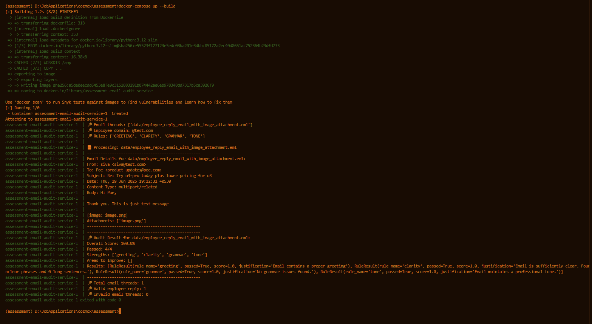

# Email Audit Service

A service to evaluate the quality and compliance of email communication between company employees and external customers. The service processes email threads (.eml format) and applies a flexible rules engine to audit them, providing detailed feedback with scoring and justifications.

## Demo Screenshot:


## Features

- **Dynamic Rules Engine**: Supports multiple rules that can be enabled/disabled:
  - Greeting Rule: Checks for proper email greetings
  - Clarity Rule: Evaluates message clarity and conciseness
  - Grammar Rule: Checks for basic grammar issues
  - Tone Rule: Ensures professional and appropriate tone

- **Key Assumptions**:
  - The last email in the thread is assumed to be the employee's response
  - Currently only analyzes the main response content (quoted/forwarded content is ignored)

- **Comprehensive Audit Reports**:
  - Overall numerical score
  - Pass/fail status per rule
  - Detailed justifications
  - Strengths and areas for improvement

## Installation

1. Clone the repository:
```bash
git clone https://github.com/ysskrishna/email-audit-service.git
cd email-audit-service
```

## Usage

### Build and Run with Docker

```bash
docker-compose up --build
```

### Command Line Arguments

- `--email-threads`: One or more email threads(.eml) files to process
- `--employee-domain`: Domain to identify employee emails (default: @test.com)
- `--rules`: Rules to apply (choices: GREETING, CLARITY, GRAMMAR, TONE)


### CLI Argument Samples

#### Process Multiple .eml files
```bash
python main.py --email-threads data/employee_reply_email_with_image_attachment.eml data/employee_reply_email_without_image_attachment.eml --employee-domain @test.com --rules GREETING CLARITY GRAMMAR TONE
```

#### Process Single .eml File with Selective Rules
```bash
python main.py --email-threads data/employee_reply_email_with_image_attachment.eml --employee-domain @test.com --rules GREETING CLARITY
```


## Testing with Custom Email Threads

To test the rule engine with your own email thread:

1. **Prepare Your Email File**:
   - Save your email thread as an `.eml` file
   - Place it in the `data/` directory
   - Example: `data/custom_email_thread.eml`

2. **Update Docker Configuration**:
   - Open `docker-compose.yml`
   - Modify the `command` section to use your email file:
   ```yaml
   command: >
     --email-threads data/custom_email_thread.eml
     --employee-domain @test.com
     --rules GREETING CLARITY GRAMMAR TONE
   ```

3. **Run the Service**:
   ```bash
   docker-compose up --build
   ```

4. **View Results**:
   - The audit results will be displayed in the console output
   - Check for the overall score and individual rule evaluations

Note: You can customize the rules and employee domain as needed. See the [Command Line Arguments](#command-line-arguments) section for more options.


## Project Structure

```
assessment/
├── core/                   # Core functionality
│   ├── email_parser.py    # Email parsing and processing
│   ├── enums.py          # Enumerations
│   └── types.py          # Data types and models
├── ruleengine/            # Rules implementation
│   ├── engine.py         # Rules engine
│   ├── rule_base.py      # Base rule class
│   └── rules/            # Individual rules
├── data/                  # Sample email files
└── main.py               # CLI entry point
```